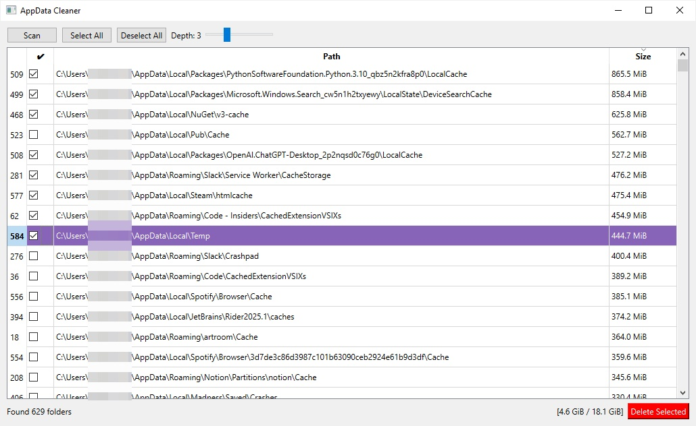

# AppData Cleaner

A simple GUI tool to clean up Windows AppData folders.

## Features

- Scans AppData, LocalAppData, and LocalLow folders
- Finds cache, temp, crash reports and other junk folders
- Shows folder sizes and allows selective deletion
- Requires Administrator privileges

## Download

Download the latest release from: https://github.com/Hermesiss/appdata-cleaner/releases

## Usage

1. Run as Administrator
2. Click "Scan" to find junk folders
3. Select folders you want to delete
4. Click "Delete Selected"

⚠️ **Warning**: This tool permanently deletes folders. Use with caution.
